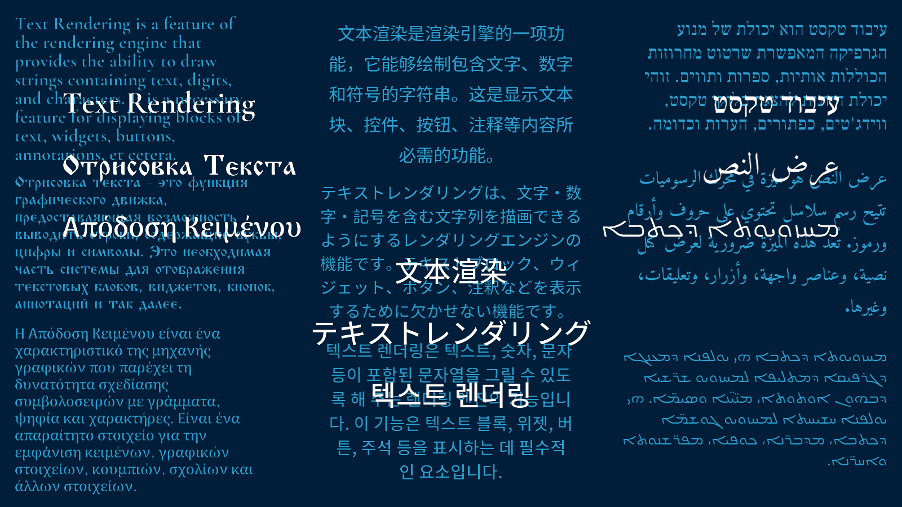

  

# MultilingualTextDemo

This demo showcases the text rendering system of the Rendering Engine.

## Overview

The application demonstrates:

- UTF-8 text handling
- Multiple writing systems
- Left-to-right (LTR) and right-to-left (RTL) layouts
- Text shaping for complex scripts
- Per-script typographic tuning (line spacing)
- Linear color workflow with sRGB conversion

## Demonstrated Scripts

- English (Latin)
- Russian (Cyrillic)
- Greek
- Chinese (Simplified)
- Japanese
- Korean
- Hebrew
- Arabic
- Syriac (Aramaic)

## Features Highlighted

- Unicode string rendering
- Glyph atlas generation
- Script range support
- RTL alignment
- Optional text shaping
- Line spacing scaling
- Linear-space background and text color

## Fonts Used

English  
Cormorant Garamond  
https://fonts.google.com/specimen/Cormorant+Garamond

Russian  
Vezitsa  
https://online-fonts.com/fonts/vezitsa

Greek  
Arima  
https://fonts.google.com/specimen/Arima

Chinese & Japanese  
Noto Sans SC  
https://fonts.google.com/noto/specimen/Noto+Sans+SC

Korean  
Noto Sans KR  
https://fonts.google.com/noto/specimen/Noto+Sans+KR

Hebrew  
Frank Ruhl Libre  
https://fonts.google.com/specimen/Frank+Ruhl+Libre

Arabic  
Amiri  
https://fonts.google.com/specimen/Amiri

Syriac (Aramaic)  
Noto Sans Syriac  
https://fonts.google.com/noto/specimen/Noto+Sans+Syriac